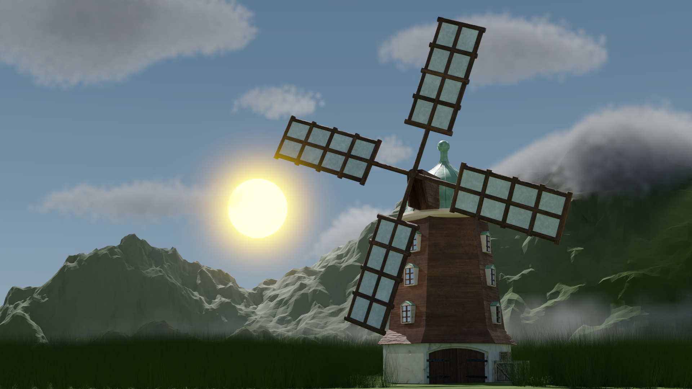
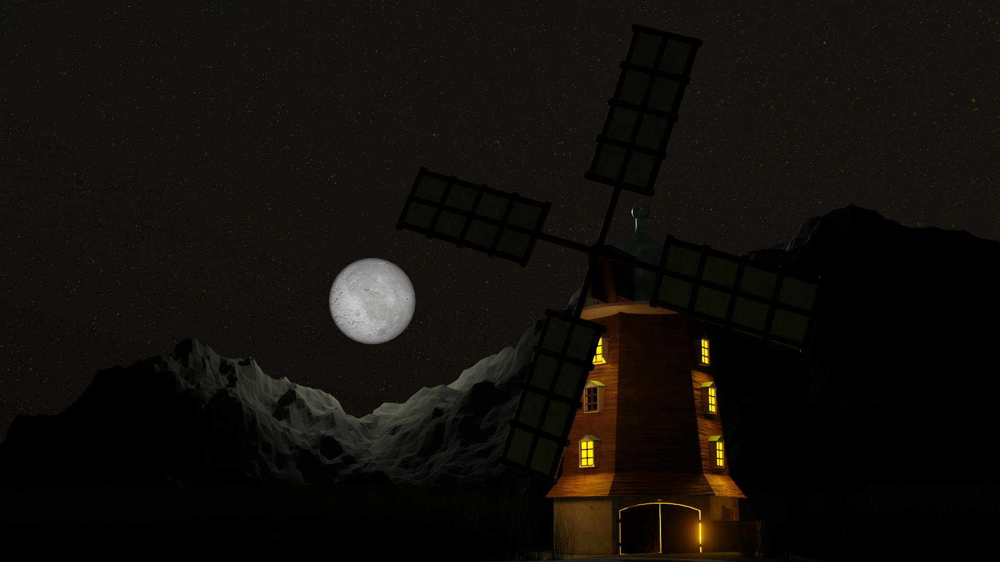
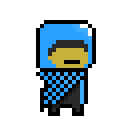
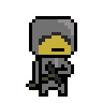

<h1 align="center"> Hi there 👋, I'm Szymon Habrych </h1>

---

<h2 align="center"> About me 🧔‍♂️</h2>

I am a graduate of Computer Science in the field of game development from Lodz University of Technology. During my time at university, I gained and honed my programming skills. I learned OpenGL + GLSL, as well as the basics of Unity and Unreal Engine.

---

<h2 align="center"> Languages and tools 🧰 </h2>

  
  
  
  
  
  
  
  
  
  
  
  

---

<h2 align="center"> Currently working on 🔨 </h2>

--- 

<h2 align="center"> Statistics 📊 </h2>

  
  

---

<h2 align="center"> My works 🤖 </h2>

  
  

  
  
  
  

